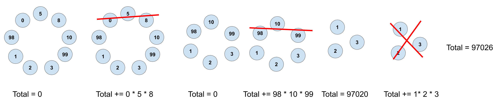

## Assignment
*This is worth 3 late days*

Implement a solution to an interview question a previous instructor was asked that only 1 out of ~80 interviewees was able to get in time. Also, it is not googlable (at least we couldn't find an answer online).

Your answer must run in **polynomial** time (n, n^2, n^3 etc.). Not N! or some constant C^N.

 Bonus points if you come up with a solution different than ours. If you can solve it using another method (that isn't cheating) that doesn't take 30 years to run, that's fine too.

### The Problem

You are given a ring of integers like the one shown below. The number of integers in the ring is a multiple of 3. You start of with a total of 0. Until all the numbers are gone, choose 3 integers in a row in the ring, multiply them together, and add the product of them to your total.

Your code should find the highest possible total possible by following these rules.
You can see example games below.

We have [hints!](./hints.md)
### Checkoffs
Reach out to Nick (gsteelman@olin.edu, @steeeeelman on Instagram) (or one of the other instructors) to get checked off or if you have questions.

You can still get checked off if you pass tests 1-8. BUT, your code cannot run forever on any of the tests.
