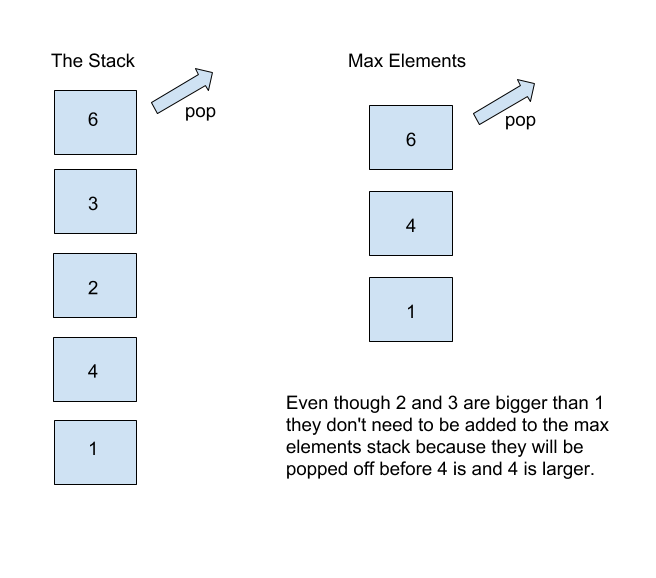

# Hints for Day02 HW

## Stack Augmentation

Keep in mind that the last element you put on the stack will be the first element to be popped off. That said, if the largest element is at the bottom of the stack, it will always be the max element.

Keep track of the maximum elements in a second linked list as shown in this example: 
