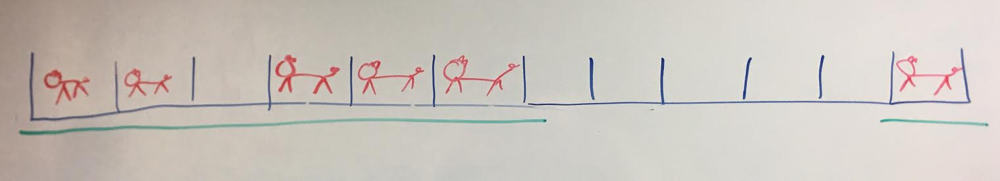
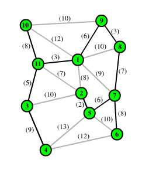

# Greedy Algorithms

**This assignment is due Monday, April 22**

- If you want a refresher on today's lecture, check out the [class slides](
https://docs.google.com/presentation/d/1dqCJ5dEeK28cr-u2gjuaGdB4DoQ3iU1fBOcW3vMykm0/edit?usp=sharing).
- If you aren't sure how to validate that a greedy algorithm always produces the correct solution, check out this [PDF](https://drive.google.com/open?id=0B_K4P69ad_l_RG9vc0VZeDhyWUk) on the greedy exchange property.
- Finally, if you want to watch another lecture, the [MIT lecture](https://youtu.be/2P-yW7LQr08?t=17m28s) covered the interval scheduling problem from class today. The formal proof of why the greedy algorithm is corect for interval scheduling begins at [42:39](https://youtu.be/2P-yW7LQr08?t=42m39s).
- If you need additional help, refer to the [`hints.md`](https://github.com/Olin-DSA/DSA-19/blob/master/greedy/hints.md) document.

## Learning Goals
- Know how to identify a greedy problem
- Be able to implement greedy algorithm
- Prove that greedy solution is the optimal solution of a problem

*Warning: Not all of the problems are greedy problems or should be solved using greedy algorithm. Aka don't be greedy with greedy.*

## Vicky's Barn

Farmer Vicky has a barn where her cows live. Cows separated by stalls, and boards are installed in front of stalls as doors.

Unfortunately, in a temper tantrum resulting from a lack of available ketchup for her lettuce, Vicky destroyed all her doors. Farmer Vicky must quickly erect new boards in front of stalls. Her new lumber supplier will supply her boards of any length she wishes, but the supplier can only deliver a certain number of boards. Farmer Vicky wishes to minimize the total length of the boards she must purchase i.e. minimize the total number of stalls she has to cover.

Given `int M`, the maximum number of boards that can be purchased, `int[] occupied` containing all the occupied stall numbers (1 <= stall_number <= S), calculate the **minimum number of stalls** that must be blocked in order to block all the stalls that have cows in them.

### Example

*Note: Farmer Vicky refused to be photographed for this example problem. The
cows however, did not mind.*

Given `M = 2, occupied = {1, 2, 4, 5, 6, 12}`:

Return 7: Vicky has to cover stalls numbered 1-6, and 12.

Return the total number of stalls blocked.

## Minimum Cost Connecting Road

Urban planner Nathan is designing roads for a new town. There are multiple important locations in town such as schools, shops, restaurants, etc... Nathan needs to plan roads that connect all these locations together. There is a cost to build between two certain locations, and Nathan's design should minimize the cost. Naturally, Nathan is having a lot of difficulty with this because he hails from a fake college with only five buildings.

  
<!-- 

  

 -->
*Note: Green dots are locations, and the price of building a road between two locations is indicated as integers. In this case, the optimal road is marked by thickened lines.*

A map of the town is represented by a `EdgeWeightedGraph` G.
This graph contains information of vertices and edges. A `Edge` class is also created. An `Edge` object store three integers: two endpoints and the weight of edge. Following are the variables and functions in`EdgeWeightedGraph()` class.

- `HashSet<Integer> vertices`: a HashSet of vertices in the graph
- `HashSet<Edge>[] edges`: an array of HashSet of edges. For example, edges[v1] is a HashSet of all of v1's edges.
- `int numberOfV()`: returns the number vertices in the graph.
- `void addEdge(Edge e)`: adds an edge along with its vertices to the graph.
- ` Iterable<Edge> edges(int v) `: returns a set of all v's edges.

Your solution will return the minimum cost of the road. In the example, the minimum cost of 1+4+3 = 8.

This question has [hints](https://github.com/Olin-DSA/DSA-19/blob/master/greedy/hints.md)!

### In addition...
When you are writing the solution, you might find the `IndexPQ` data structure useful. `IndexPQ` is essentially a priority queue where you can change the key of object in the queue. This is the data-structure you would use when implementing Dijkstra's algorithm.
- `IndexPQ(int maxN)` : initializes a PQ that can store at most maxN elements.
- `boolean isEmpty()`: check if PQ is empty.
- `void insert(int i, Key key)`: insert i with its priority key.
- `int delMin()`: delete the element with min key.
- `void change(int i, Key key)`: change the key of i to a new key.
- `void decreaseKey(int i, Key key)`: decrease the key of i to a new key.

## First Version with Failure

Product Manager Nick has just switched teams at his company. He discovers to his dismay that his new team doesn't offer complementary protein shakes and, less importantly, that their product fails a quality check. The team has been using a version control system where they label versions in a consecutive fashion, `[1, 2, ... , n]`, and perform a quality check at each version. Because versions are developed one after another, if version `j` fails the check, version `j+1` must also fail the check, if it exists.

The team has an API `IsFailingVersion`, which will tell you if a given version number fails the quality check. For example, if given `IsFailingVersion version`, then `version.isFailingVersion(j)` will tell you if j is failing.  

Write a function to help PM Nick find the *first* failing version number. You can assume version numbering started at `1`, and that the newest version is labeled `n`.( `n` may be quite large, and is represented by a `long`. The max value of an `int` is lower than that of a `long`.)

This question has a [hint](https://github.com/Olin-DSA/DSA-19/blob/master/greedy/hints.md)!

## Submitting the assignment

To get credit when you are done:

- Go to NINJA hours to get checked off
- Submit [this](https://forms.gle/AmHG8c34SfhZru4u6) survey
- Get Vicky some ketchup and give Nick a protein shake
